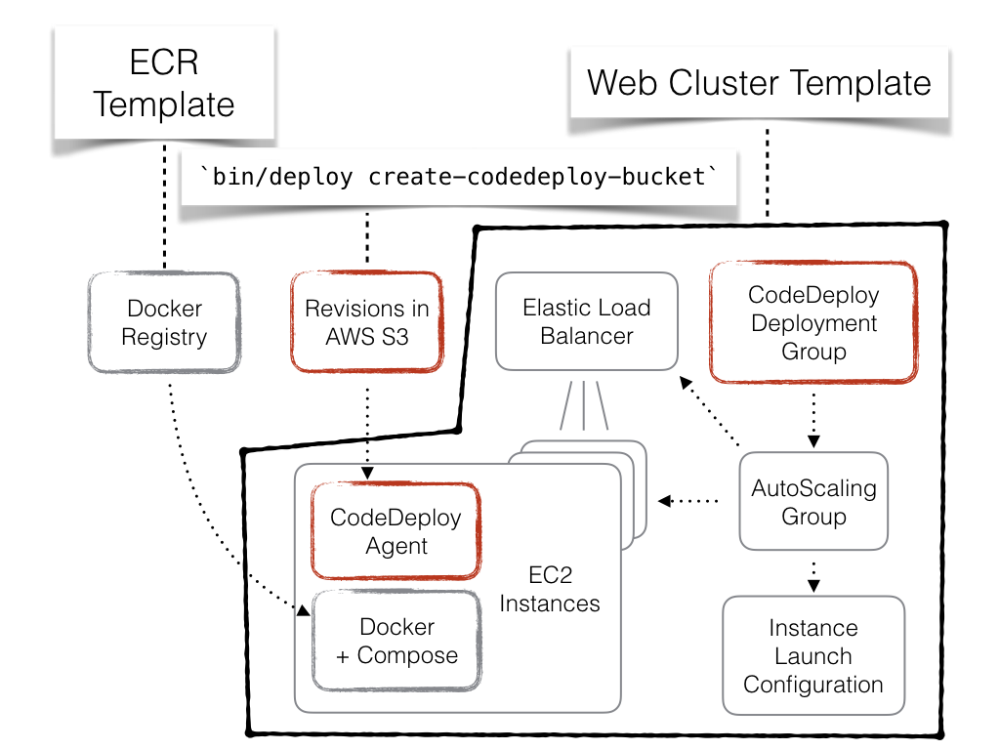

# AWS Candy Tools

AWS Candy Tools were made to support two tasks:

 - provision infrastructure in AWS account for running your applications in Docker;
 - deploy the applications as long as their configuration from command line.

## Prerequisites

 - *nix environment (Linux, Mac OS)

    > AWS Candy Tools provides a set of Bash scripts to do the tasks, so you'll need a *nix environment to use them.

 - AWS CLI
 
    > The scripts use AWS CLI under the hood, so they must be installed and configured in your environment.

 - Java

    > AWS Candy Tools distributed as a Gradle plugin as they were originally built for Java applications. This does not mean, however, that you cannot use them with your Rails, Node.js, or other stack, but you'll need to have Java available in your environment.

 - Docker

    > 1) Your application must be able to run in Docker.
    > 2) You may need Docker installed in your environment for building Docker images.

# Overview

AWS Candy Tools were built around a CloudFormation template that we'll refer to as _"Web Cluster."_

"Web Cluster" has all the major components you may need to run a typical web service:



1) Load Balancer to accept incoming web traffic; it can be either public ELB, internal ELB, or none.
2) Auto-Scaling Group to maintain desired number of EC2 instances in the cluster.
3) Each EC2 instance will have associated Instance profile to simplify security configuration.
4) CodeDeploy configuration associated with the Auto-Scaling Group to do deployments.
5) Docker daemon and `docker-compose` available on every EC2 instance.

A complete web application may consist of more than one "Web Cluster", each hosting its own web service and communicating with each other by HTTP.

# Installation

## Add plugin to an existing Gradle project

Best practice is to add the plugin to its own Gradle sub-project of your multi-project build:

 1. Add the plugin to `build.gradle`.
```
buildscript {
    repositories {
        maven {
            url  "http://dl.bintray.com/satago/maven"
        }
    }
    dependencies {
        classpath 'net.satago.gradle:aws-candy-tools:0.2.9'
    }
}

apply plugin: 'net.satago.gradle.aws-candy-tools'
```

## Add plugin to a non-Gradle project
Install Gradle if you don't have it yet.

Create a new folder somewhere in your project and initialize new Gradle project, i.e.:

```
$ mkdir devops
$ cd devops
$ gradle init
```

Now add the plugin to your brand new Gradle project as described above.

## Plugin setup

Assuming you've added the plugin to your build project.

 2. Verify the plugin has been applied, you should see the following tasks:
    ```
    ./gradlew tasks
    
    ...
    AWS Candy Tools tasks
    ---------------------
    binInit - Initialises bin/ directory using plugin's resource bundle
    copyBundle - Copies plugin's resource bundle out from the plugin's JAR
    createRevisions - Creates CodeDeploy revision folders for all configured revisions
    tarRevisions - Packages all CodeDeploy revisions into a self-contained redistributable archive
    untarBundle - Unpacks the plugin's resource bundle into a working directory
    untarRevisions - Extracts previously packaged revisions archive (for debugging purposes)
    
    ...
    
    ```

 3. Run `binInit` task:
    ```
    $ ./gradlew binInit
    :copyBundle
    :untarBundle
    :binInit
    
    BUILD SUCCESSFUL
    ```

 4. Edit `bin/set-aws-profile` and `bin/set-bastion-ssh` following the instructions inside them.

 5. The `bin/` folder with its content should be committed to your repository.

# Provisioning infrastructure

## Creating a stack

To create a stack:

 1. Create a folder `cloudformation-stacks` in your project's root directory.
 2. Create a subfolder in `cloudformation-stacks` with the name of new stack, i.e. `ecr-service-A`.
 3. Pick one of the [built-in CloudFormation templates](#built-in-templates), i.e. `cloudformation-templates/ecr-template.json`.
 4. In the stack folder create a file named after name of the template, i.e. `cloudformation-stacks/ecr-service-A/ecr-parameters.json`.
 5. Edit the parameters file as a regular CloudFormation parameters file, specifying parameter values for the template.
 6. Run `bin/exec stack create ecr-service-A` to create the stack.
 7. (Optional) Wait for stack creation: `bin/exec stack wait ecr-service-A`.

Other stacks can be created in the same way, i.e. to create a "Web Cluster" stack for an application named "revision-A":
 1. Create a file `cloudformation-stacks/revision-A/web-cluster-parameters.json`
 2. Run `bin/exec stack create revision-A`
 3. Wait `bin/exec stack wait revision-A`

Now everything is ready to accept deployments.


# Deployment configuration

You configure deployments by specifying declarations of services and revisions in the `candy` block of a Gradle project.

A _service_ is something that can produce a Docker image. The plugin can help you build, tag, and publish your Docker images for you.

A _revision_ specifies what should be inside a CodeDeploy revision folder. You usually put one of more `docker-compose.yml` files and other files required to run your docker containers.

## CodeDeploy revision folder

Before going further let's look at a unit of deployment -- CodeDeploy revision folder.

List of the files below represents content of a revision folder. Files after the `--` marker are <a name="#common-codedeploy-files">common CodeDeploy files</a>; everything above the marker are custom files specific to a particular application.
 
By convention all `docker-compose.yml` files are put in the root of revision folder. Other application-specific files stored in a `data/` subfolder.

```
revision-A/data/config.properties
revision-A/data/service-a/Dockerfile
revision-A/data/service-b/Dockerfile
revision-A/docker-compose.service-A.yml
--
revision-A/appspec.yml
revision-A/compose.bash
revision-A/compose.env
revision-A/decrypt
revision-A/decrypt-file.py
revision-A/decrypt-properties.bash
revision-A/elb/common_functions.sh
revision-A/elb/deregister_from_elb.sh
revision-A/elb/README.md
revision-A/elb/register_with_elb.sh
revision-A/elb/wait_for_elb.sh
revision-A/pre-hooks.bash
revision-A/pull.bash
revision-A/replace.py
revision-A/stop.bash
revision-A/symlink.bash
revision-A/up.bash
revision-A/validate.bash
```

AWS CodeDeploy only requires one file named `appspec.yml`.

CodeDeploy defines application lifecycle hooks, i.e. `ApplicationStart`, `ApplicationStop`, `BeforeInstall`, [etc.](http://docs.aws.amazon.com/codedeploy/latest/userguide/app-spec-ref.html), the plugin utilizes these hooks to run the content of revision folder as a `docker-compose` application.

## Configuring services and revisions

Let's look at the following example of configuring the deployments in `build.gradle`:

```
candy {
    services {
        SERVICE_A {
            ecrStackName 'ecr-service-A'
            composeBuild {
                serviceName 'service-a'
            }
        }
        SERVICE_B {
            ecrStackName 'ecr-service-B'
            dockerJava {
                project rootProject
                taskName 'buildImageServiceB'
            }
        }
    }
    revisions {
        'revision-A' {
            //  It's possible to specify more than one compose file separated by comma,
            //  they'll be passed using `-f` option to the `docker-compose`
            composeFiles 'docker-compose.service-A.yml'
            services 'SERVICE_A', 'SERVICE_B'
            resources copySpec() {
                from "apps/common-files/"
                into "data"
            }
        }
    }
}

apply plugin: 'com.bmuschko.docker-remote-api'

import com.bmuschko.gradle.docker.tasks.image.DockerBuildImage

task buildImageServiceB(type: DockerBuildImage) {
    inputDir = file("apps/revision-A/service-b")
    tag = "service-b:latest"
}
```

### Services

Here we have two services:
 - `SERVICE_A` -- its Docker image will be built by running `docker-compose ... build service-a` command inside created revision folder.
 - `SERVICE_B` -- its Docker image will be built by running the `buildImageServiceB` Gradle task of the `rootProject`. The build task should be of type `DockerBuildImage` from the [`com.bmuschko.docker-remote-api`](https://github.com/bmuschko/gradle-docker-plugin) plugin.

The `ecrStackName` property defines the name of Elastic Container Registry stack where image will be uploaded. The stack must be previously created using the [`ecr-template`](#ecr-template), i.e. `bin/exec stack create ecr-service-A`.

### Revisions

The only revision named `revision-A` will create revision folder `build/revisions/revision-A`.

The revision folder will have:
 - [common CodeDeploy files](#common-codedeploy-files);
 - `docker-compose.service-A.yml`;
 - files from `apps/revision-A/` will appear in `data/` by default;
 - files from `apps/common-files/` will be copied to `data/` explicitly.

<a name="built-in-templates"></a>
## Built-in CloudFormation templates

<a name="ecr-template"></a>
### ecr-template.json

Creates new Elastic Container Registry (ECR) -- a private docker image registry in AWS.

<a name="elasticsearch-template"></a>
### elasticsearch-template.json

Creates new Elasticsearch Cluster in AWS.

<a name="s3-bucket-policy-template"></a>
### s3-bucket-policy-template.json

Creates few managed IAM policies for existing S3 bucket.

The policies may be attached to an InstanceProfile of EC2 instances via `ManagedPolicyArns` parameter of the [`web-cluster-template`](#web-cluster-template).

<a name="web-cluster-template"></a>
### web-cluster-template.json

Creates a ["Web Cluster"](#Overview).
